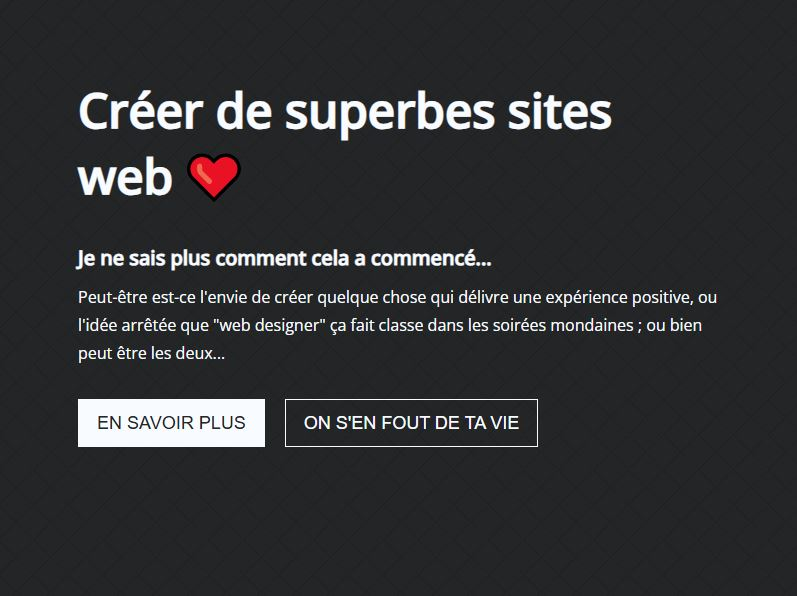

# Side project : « Créer de superbes sites web »

Une landing page à l'humour décalé, avec une micro-interaction derrière chaque bouton.



**Démo : [el-cassegrain.github.io/side-project](https://el-cassegrain.github.io/side-project/)**


## Contexte

Projet personnel pour expérimenter les micro-interactions et l'humour dans une interface, sans framework.

## Fonctionnalités

- « En savoir plus » ouvre une pop-up avec mes liens et déclenche une pluie de smileys générés en JavaScript
- Le second bouton lance une vidéo au survol ou au focus clavier
- Animation de confettis avec Lottie
- Interactions accessibles au clavier (focus) autant qu'à la souris

## Installation

C'est un site statique, sans étape de build.

```bash
git clone https://github.com/El-Cassegrain/side-project.git
cd side-project
pnpm dlx serve .
```

---

Réalisé par [Etienne Leriche](https://etienneleriche.com), designer UI/UX et développeur front-end.
